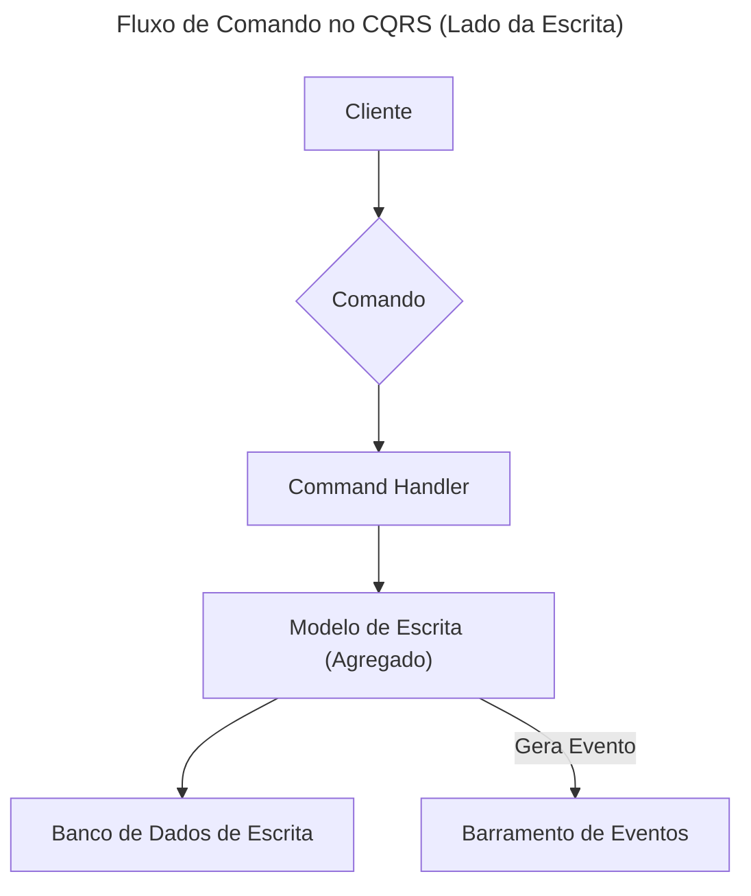
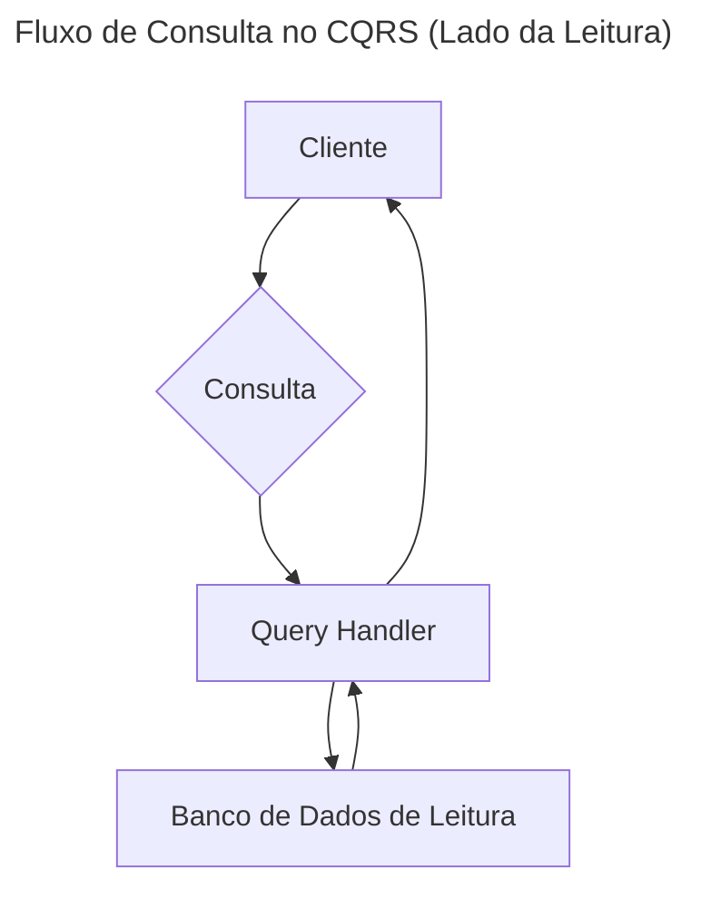

> O CQRS é um padrão arquitetural que separa as operações de leitura (Query) das operações de escrita (Command) em um
> sistema.

**CQRS (Command Query Responsibility Segregation)** é um padrão arquitetural que se baseia em uma premissa simples: os
modelos de dados usados para atualizar informações (escrita) e para consultar informações (leitura) devem ser distintos.
Em vez de usar um único modelo para ambas as operações (como no padrão CRUD tradicional), o CQRS propõe a criação de
dois modelos separados, otimizados para suas respectivas tarefas. No contexto deste repositório, ele é fundamental para
construir aplicações robustas e escaláveis, como demonstrado no projeto `userservice`.

---

## O que é e Para que Serve?

O principal propósito do CQRS é resolver a complexidade e a ineficiência que surgem quando um único modelo de dados
tenta servir a dois mestres com necessidades fundamentalmente diferentes: a escrita e a leitura.

* **Commands (Comandos):** São operações que alteram o estado do sistema. Eles são focados em intenção (ex:
  `CreateUserCommand`, `UpdateUserAddressCommand`) e não retornam dados, apenas a confirmação de sucesso ou falha. O
  modelo de escrita, ou *Write Model*, é projetado para garantir a consistência dos dados e aplicar as regras de
  negócio.

* **Queries (Consultas):** São operações que leem o estado do sistema sem alterá-lo. Elas são projetadas para serem
  eficientes e flexíveis, retornando dados em formatos otimizados para a exibição (ex: DTOs). O modelo de leitura, ou
  *Read Model*, pode ser uma visão denormalizada e materializada dos dados, projetada para responder a perguntas
  específicas da interface do usuário de forma rápida.

A separação permite que cada modelo evolua de forma independente, utilizando as estruturas de dados e tecnologias de
persistência mais adequadas para cada caso.

## Como Funciona

A comunicação dentro de uma arquitetura CQRS segue dois fluxos distintos e paralelos:

### Fluxo de Escrita (Command)

O objetivo deste fluxo é validar a intenção do usuário e, se válida, alterar o estado do sistema de forma consistente.



1. O **Cliente** envia um **Comando** que representa uma intenção de mudança.
2. O **Command Handler** recebe o comando, valida-o e orquestra a lógica de negócio.
3. O **Modelo de Escrita** (geralmente um Agregado do DDD) aplica as regras de negócio e, se tudo estiver correto,
   produz um ou mais eventos.
4. O novo estado (ou os eventos) é persistido no **Banco de Dados de Escrita**.
5. Opcionalmente, os eventos são publicados em um **Barramento de Eventos** para notificar outras partes do sistema (
   como o modelo de leitura).

### Fluxo de Leitura (Query)

O objetivo deste fluxo é fornecer dados ao cliente da forma mais rápida e eficiente possível.



1. O **Cliente** envia uma **Consulta** solicitando dados.
2. O **Query Handler** recebe a consulta.
3. Ele acessa diretamente o **Banco de Dados de Leitura**, que contém visões pré-processadas e otimizadas dos dados.
4. Os dados são retornados ao cliente, geralmente na forma de DTOs simples.

A sincronização entre o banco de escrita e o de leitura é tipicamente feita de forma assíncrona, através de um processo
que ouve os eventos gerados pelo modelo de escrita e atualiza as visões no modelo de leitura.

## Vantagens e Benefícios

* **Escalabilidade Independente:** A carga de leitura e escrita pode ser escalada de forma independente. Se a aplicação
  tem muito mais leituras do que escritas, pode-se adicionar mais réplicas do banco de dados de leitura sem impactar o
  lado da escrita.
* **Performance Otimizada:** O modelo de leitura pode ser altamente otimizado (denormalizado) para consultas
  específicas, eliminando a necessidade de joins complexos. O modelo de escrita pode ser otimizado para consistência
  transacional.
* **Flexibilidade de Modelagem:** É possível ter múltiplos modelos de leitura para atender a diferentes necessidades da
  aplicação (ex: uma visão para a tela de pesquisa, outra para um dashboard administrativo), cada um com sua própria
  estrutura e tecnologia de persistência.
* **Segurança e Clareza:** A separação de responsabilidades torna o código mais claro e seguro. As operações que
  modificam dados estão isoladas daquelas que apenas leem, simplificando a aplicação de permissões e a análise do fluxo
  de dados.

## Desvantagens e Desafios

* **Aumento da Complexidade:** CQRS não é um padrão simples. Ele introduz mais componentes (dois modelos, lógica de
  sincronização) e pode aumentar a complexidade geral do sistema, exigindo mais código e infraestrutura.
* **Consistência Eventual:** Como o modelo de leitura é geralmente atualizado de forma assíncrona, há um pequeno
  intervalo de tempo em que ele pode estar desatualizado em relação ao modelo de escrita. A aplicação e o usuário devem
  ser capazes de lidar com essa consistência eventual.
* **Duplicação de Código:** Embora os modelos sejam diferentes, pode haver alguma duplicação de informações ou lógica de
  mapeamento entre o modelo de escrita e o de leitura.

## Quando Usar?

Recomenda-se a aplicação de CQRS em cenários como:

* **Domínios de negócio complexos e colaborativos:** Onde múltiplos usuários interagem com os mesmos dados e as regras
  de validação para escrita são significativamente diferentes das necessidades de consulta.
* **Sistemas com cargas de trabalho assimétricas:** Quando o volume de leituras é drasticamente maior que o de escritas,
  ou vice-versa.
* **Necessidade de modelos de dados distintos:** Quando a forma como os dados são apresentados ao usuário é muito
  diferente de sua estrutura de armazenamento transacional.
* **Aplicações orientadas a tarefas:** Onde a interface do usuário é construída em torno de fluxos de trabalho e ações
  específicas, em vez de uma simples visualização de dados CRUD.

## Exemplo Prático no Repositório

A aplicação mais clara de CQRS neste repositório está no projeto `userservice`.

* **Localização:** [`/userservice`](https://github.com/JulianeMaran32/SoftwareArchitecture/tree/main/userservice)

Analisando o código, podemos observar a separação de responsabilidades nos pacotes de serviço e nos modelos:

* **Serviços Separados:** Existem serviços dedicados para comandos (ex: `UserCommandService`) e para queries (ex:
  `UserQueryService`), cada um com sua própria interface e implementação.
* **Modelos Distintos:** O modelo de escrita opera sobre a entidade de domínio `User`, que contém a lógica de negócio e
  as validações. O modelo de leitura opera diretamente com o Elasticsearch, retornando DTOs ou projeções otimizadas para
  consulta.

```java
// Exemplo conceitual da separação de serviços

// Lado dos Comandos (Write Model)
public interface UserCommandService {
  void createUser(CreateUserCommand command);

  void updateUser(UpdateUserCommand command);
}

// Lado das Consultas (Read Model)
public interface UserQueryService {
  UserDTO findUserById(String id);

  List<UserDTO> findUsersByCriteria(UserSearchCriteria criteria);
}
```

## Resumo

| Aspecto               | Descrição                                                                                                               |
|:----------------------|:------------------------------------------------------------------------------------------------------------------------|
| **Tipo**              | Padrão Arquitetural                                                                                                     |
| **Principal Foco**    | Separação de responsabilidades entre operações de escrita (Command) e leitura (Query).                                  |
| **Ideal para**        | Sistemas complexos com cargas de trabalho assimétricas ou com necessidades de consulta muito diferentes das de escrita. |
| **Principal Desafio** | Gerenciamento da consistência eventual e o aumento da complexidade da arquitetura.                                      |

---

### Tópicos Relacionados

* [DDD (Domain-Driven Design)](DDD-(Domain-Driven-Design))
* [Event Sourcing](Event-Sourcing)
