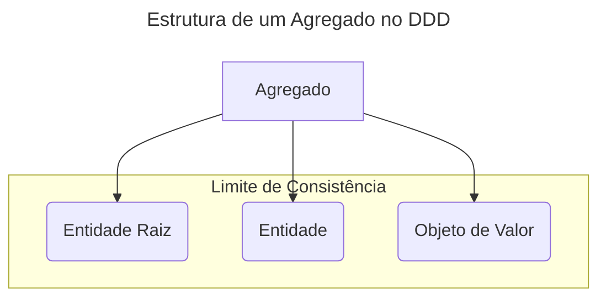

# DDD (Domain-Driven Design)

> DDD é uma abordagem para o desenvolvimento de software que coloca o foco no domínio do negócio, criando modelos ricos
> que refletem a complexidade e a linguagem do mundo real.

**Domain-Driven Design (DDD)**, ou Design Guiado pelo Domínio, é uma filosofia de desenvolvimento de software que
prioriza a colaboração entre desenvolvedores e especialistas de negócio para construir um modelo de domínio robusto e
expressivo. O objetivo é que o código-fonte seja um reflexo direto da linguagem e dos processos do negócio, tornando o
sistema mais alinhado aos seus objetivos e mais fácil de evoluir. No contexto deste repositório, DDD é a base para a
modelagem dos projetos `userservice` e `stockeventsourcing`.

---

## O que é e Para que Serve?

O DDD não é um framework ou uma tecnologia, mas sim um conjunto de princípios e padrões que ajudam a lidar com a
complexidade de domínios de negócio. Ele resolve um problema comum: o distanciamento entre a equipe técnica e a área de
negócio, que muitas vezes resulta em software que não atende às necessidades reais ou que se torna frágil e difícil de
manter.

Para isso, o DDD se divide em dois conjuntos de ferramentas:

* **Padrões Estratégicos:** Ajudam a entender e organizar o domínio em um nível macro. Focam em definir os limites dos
  contextos de negócio, a linguagem compartilhada e como diferentes partes do sistema se integram.
* **Padrões Táticos:** Ajudam a construir o modelo de domínio em um nível micro, dentro de um contexto específico. São
  os blocos de construção do código, como Entidades, Agregados e Serviços de Domínio.

## Princípios e Conceitos Chave

DDD é composto por vários conceitos interligados que formam a base da sua aplicação.

#### Padrões Estratégicos

* **Linguagem Ubíqua (Ubiquitous Language):** A criação de uma linguagem comum, rigorosa e compartilhada entre
  desenvolvedores e especialistas de domínio. Essa linguagem deve ser usada em conversas, diagramas, documentos e,
  principalmente, no código (nomes de classes, métodos e variáveis).
* **Contexto Delimitado (Bounded Context):** Define os limites onde um modelo de domínio específico é válido. Dentro de
  um contexto, cada termo da Linguagem Ubíqua tem um significado único e preciso. Por exemplo, o conceito de "Produto"
  pode significar algo diferente no contexto de "Vendas" (preço, desconto) e no de "Estoque" (quantidade, localização).
* **Mapa de Contextos (Context Map):** Um diagrama que mostra as relações entre os diferentes Contextos Delimitados.
  Ajuda a visualizar como as equipes e os sistemas se integram e a definir contratos claros entre eles.

#### Padrões Táticos

Estes são os blocos de construção implementados no código.



* **Entidade (Entity):** Um objeto que não é definido por seus atributos, mas por sua identidade e continuidade ao longo
  do tempo. Possui um ID único. Exemplo: um `Usuário`, um `Pedido`.
* **Objeto de Valor (Value Object):** Um objeto que descreve uma característica de algo e não possui identidade própria.
  É definido por seus atributos e é imutável. Exemplo: um `Endereço`, uma `Cor`, uma `QuantiaEmDinheiro`.
* **Agregado (Aggregate):** Um cluster de Entidades e Objetos de Valor que são tratados como uma unidade única para fins
  de mudanças de dados. Cada agregado tem uma **Entidade Raiz**, que é o único ponto de entrada para qualquer
  modificação dentro do agregado. O agregado é a barreira que garante a consistência das regras de negócio. Exemplo: um
  `Pedido` (raiz) com seus `ItensDePedido` (entidades) e `EndereçoDeEntrega` (objeto de valor).
* **Serviço de Domínio (Domain Service):** Quando uma operação ou regra de negócio não pertence naturalmente a nenhuma
  Entidade ou Objeto de Valor, ela pode ser implementada em um serviço de domínio. Esses serviços são stateless e
  encapsulam a lógica do domínio.
* **Repositório (Repository):** Uma abstração que fornece uma interface de coleção para acessar e persistir os
  Agregados, escondendo os detalhes da tecnologia de banco de dados.

## Vantagens e Benefícios

* **Alinhamento com o Negócio:** O software reflete com mais precisão os processos e as regras do negócio, entregando
  mais valor.
* **Comunicação Aprimorada:** A Linguagem Ubíqua quebra as barreiras de comunicação entre as equipes técnica e de
  negócio.
* **Manutenibilidade e Flexibilidade:** Um modelo de domínio bem definido torna o código mais fácil de entender, manter
  e estender.
* **Redução da Complexidade:** Ao dividir o domínio em Contextos Delimitados, a complexidade de cada parte se torna
  gerenciável.

## Desvantagens e Desafios

* **Não é para todos os projetos:** DDD brilha em domínios complexos. Em aplicações simples, baseadas em CRUD, o esforço
  pode não se justificar e pode levar à superengenharia.
* **Curva de Aprendizagem:** Requer um investimento significativo de tempo para que a equipe aprenda e aplique
  corretamente os princípios e padrões.
* **Necessidade de Especialistas de Domínio:** O sucesso do DDD depende da disponibilidade e colaboração contínua de
  especialistas que entendam profundamente o negócio.

## Quando Usar?

* **Domínios de Negócio Complexos:** Quando as regras de negócio são intrincadas, numerosas e o coração do software.
* **Projetos de Longa Duração:** O investimento inicial em modelagem se paga ao longo do tempo com a facilidade de
  manutenção e evolução.
* **Arquitetura de Microsserviços:** Os Contextos Delimitados do DDD são uma forma natural e eficaz de definir os
  limites dos microsserviços.
* **Equipes com Forte Colaboração:** Quando há uma cultura de colaboração estreita entre desenvolvedores, QAs, Product
  Owners e outros stakeholders.

## Exemplo Prático no Repositório

O DDD é a base filosófica de ambos os projetos principais.

* **Localização:** [`/userservice`](https://github.com/JulianeMaran32/SoftwareArchitecture/tree/main/userservice) e [
  `/stockeventsourcing`](https://github.com/JulianeMaran32/SoftwareArchitecture/tree/main/stockeventsourcing)

No projeto `stockeventsourcing`, podemos ver claramente os padrões táticos em ação:

* **Agregado:** A classe `ProductAggregate.java` atua como o agregado. Ela encapsula todo o estado do estoque de um
  produto e garante que todas as operações (reservar, vender) sigam as regras de negócio (ex: não é possível vender mais
  do que há em estoque).
* **Eventos de Domínio:** As mudanças no `ProductAggregate` são capturadas como eventos (ex: `ProductReservedEvent`),
  que são um padrão comum em domínios ricos.

```java
// Exemplo da estrutura de um Agregado
public class ProductAggregate {

  // Estado interno mantido em memória
  private String sku;
  private int availableQuantity;
  private int reservedQuantity;

  // Construtor privado para forçar o uso de um método fábrica ou reidratação
  private ProductAggregate() {
  }

  // Ponto de entrada para modificação. Garante as regras de negócio.
  public void reserveStock(int quantityToReserve) {
    if (availableQuantity < quantityToReserve) {
      throw new InsufficientStockException("Estoque insuficiente.");
    }
    // Lógica para gerar um evento 'ProductReservedEvent'
    // ...
  }

  // Método que aplica eventos para alterar o estado interno
  private void apply(ProductEvent event) {
    // ...
  }
}
```

## Resumo

| Aspecto               | Descrição                                                                                    |
|:----------------------|:---------------------------------------------------------------------------------------------|
| **Tipo**              | Abordagem de Desenvolvimento de Software                                                     |
| **Principal Foco**    | Modelar o software com base na complexidade e linguagem do domínio de negócio.               |
| **Ideal para**        | Projetos com domínios de negócio complexos e de longa duração.                               |
| **Principal Desafio** | A curva de aprendizagem e a necessidade de colaboração intensa com especialistas de domínio. |

---

## Tópicos Relacionados

* [CQRS (Command Query Responsibility Segregation)](CQRS-(Command-Query-Responsibility-Segregation))
* [Event Sourcing](Event-Sourcing)
* [Arquitetura de Microsserviços](Microservices-Architecture.md)