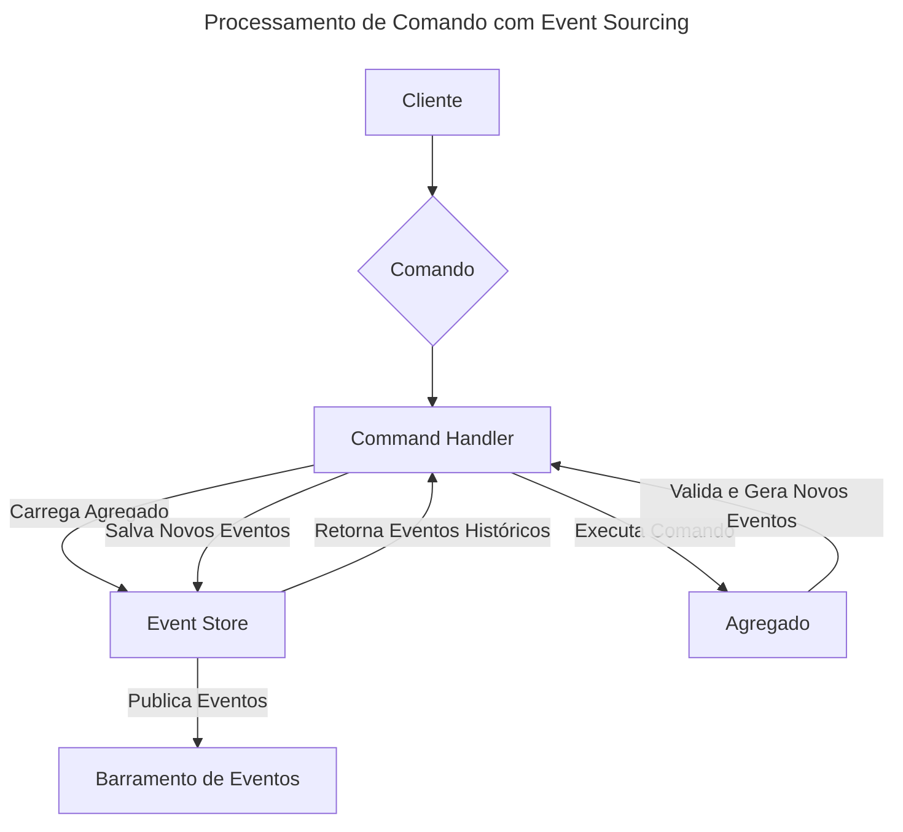

# Event Sourcing

> Em vez de armazenar apenas o estado atual dos dados, armazenamos cada mudança como um evento imutável em uma sequência
> cronológica.

**Event Sourcing** é um padrão arquitetural onde o estado de uma entidade de negócio (um Agregado) não é salvo
diretamente. Em vez disso, cada alteração nesse estado é capturada e armazenada como um evento individual e imutável.
Para obter o estado atual da entidade, todos os eventos relacionados a ela são lidos e aplicados em sequência. O log de
eventos se torna a fonte única da verdade. No contexto deste repositório, ele é o pilar do projeto `stockeventsourcing`.

---

## O que é e Para que Serve?

O principal propósito do Event Sourcing é mudar a forma como pensamos sobre a persistência de dados: de "o que é o
estado agora?" para "o que aconteceu para chegarmos até aqui?".

Em um sistema CRUD tradicional, quando um dado é atualizado (por exemplo, o endereço de um cliente), o valor antigo é
perdido para sempre, sobrescrito pelo novo. Com Event Sourcing, teríamos eventos como `ClienteCriado`,
`EnderecoAtualizado`, `CompraRealizada`. Cada um desses eventos é um fato que ocorreu no passado e não pode ser
alterado.

Isso resolve problemas como:

* **Perda de Informação:** Nunca perdemos o contexto de como um estado foi alcançado. A intenção por trás de cada
  mudança é preservada.
* **Auditoria e Rastreabilidade:** O log de eventos serve como uma trilha de auditoria completa e à prova de adulteração
  de tudo o que aconteceu no sistema.
* **Análise Temporal:** É possível reconstruir o estado de uma entidade em qualquer ponto do tempo no passado,
  simplesmente aplicando os eventos até aquele momento.

## Como Funciona

O fluxo de trabalho em um sistema com Event Sourcing é centrado na geração e aplicação de eventos.



1. O **Cliente** envia um **Comando** (ex: "Reservar 10 unidades do produto X").
2. O **Command Handler** recebe o comando. Para processá-lo, ele primeiro precisa do estado atual do produto.
3. Ele consulta o **Event Store** e pede todos os eventos para o produto X.
4. O Event Store retorna a sequência de eventos (ex: `ProdutoAdicionado`, `ProdutoVendido`).
5. O **Agregado** é "reidratado": uma instância vazia é criada e cada evento histórico é aplicado a ela, um por um, até
   que o estado atual seja reconstruído na memória.
6. O Command Handler então executa o comando no agregado já com seu estado atual.
7. O agregado valida o comando com base em suas regras de negócio. Se for válido, ele gera um novo evento (ex:
   `ProdutoReservado`) mas **ainda não altera seu próprio estado**.
8. O Command Handler recebe o novo evento e o persiste no **Event Store**, anexando-o ao final da lista de eventos
   daquele agregado.
9. Finalmente, o Event Store publica o novo evento em um **Barramento de Eventos**, para que outros componentes (como as
   projeções do CQRS) possam reagir a ele.

## Vantagens e Benefícios

* **Auditoria Completa:** Fornece um histórico completo e imutável de todas as transações, o que é um requisito em
  muitos setores (financeiro, saúde).
* **Análise Temporal e Depuração:** Permite depurar problemas complexos reconstruindo o estado exato de uma entidade
  antes de um erro ocorrer. Também possibilita a análise de tendências e a geração de relatórios históricos.
* **Flexibilidade para o Futuro:** Como todos os dados brutos (eventos) são preservados, é possível criar novas visões (
  projeções) dos dados no futuro para atender a novos requisitos de negócio, simplesmente reprocessando o log de
  eventos.
* **Performance de Escrita:** Anexar um novo evento a um log é uma operação de escrita extremamente rápida e eficiente,
  pois não envolve atualizações (updates) ou exclusões (deletes).

## Desvantagens e Desafios

* **Curva de Aprendizagem:** É um paradigma diferente do CRUD tradicional e exige uma mudança de mentalidade da equipe
  de desenvolvimento.
* **Reidratação de Agregados:** Para agregados com um histórico muito longo (milhões de eventos), reconstruir o estado a
  partir do zero pode se tornar um gargalo de performance. Isso pode ser mitigado com o uso de *Snapshots* (fotos
  periódicas do estado).
* **Consultas Complexas:** Consultar o estado atual de múltiplos agregados ou fazer buscas complexas diretamente no log
  de eventos é ineficiente. Por isso, o Event Sourcing é quase sempre implementado em conjunto com o **CQRS**, onde o
  lado da leitura (Query) é alimentado pelos eventos para criar projeções otimizadas.
* **Evolução de Eventos (Schema Versioning):** Uma vez que um evento é salvo, ele é imutável. Se a estrutura de um
  evento precisa mudar (ex: adicionar um novo campo), é preciso ter uma estratégia de versionamento para lidar com os
  eventos antigos.

## Quando Usar?

* **Domínios de Negócio Colaborativos:** Aplicações onde o mesmo dado é modificado por múltiplos atores e a ordem e
  intenção das mudanças são cruciais (ex: um sistema de reservas, um editor de documentos colaborativo).
* **Requisitos de Auditoria Rigorosos:** Quando é essencial saber não apenas o estado atual, mas quem, quando e por que
  o alterou.
* **Análise de Dados Históricos:** Quando a capacidade de analisar o comportamento do usuário ou do sistema ao longo do
  tempo é um requisito de negócio.
* **Sistemas que Precisam de Resiliência:** O log de eventos pode ser facilmente replicado e, em caso de falha no modelo
  de leitura, ele pode ser completamente reconstruído a partir do log.

## Exemplo Prático no Repositório

A implementação canônica de Event Sourcing neste repositório está no projeto `stockeventsourcing`.

* **Localização:** [
  `/stockeventsourcing`](https://github.com/JulianeMaran32/SoftwareArchitecture/tree/main/stockeventsourcing)

Analisando o código, podemos observar:

* **Event Store:** A persistência é feita na tabela `event_store`, representada pela entidade `EventStoreEntity.java`.
  Ela armazena o ID do agregado, o tipo do evento, os dados do evento (como JSON) e sua versão.
* **Agregado:** A classe `ProductAggregate.java` não possui estado persistido diretamente. Seu método `rehydrate`
  reconstrói o estado a partir de uma lista de eventos. Seus métodos de negócio (ex: `reserveStock`) validam comandos e
  geram novos eventos.
* **Serviços:** O `ProductCommandService.java` orquestra o processo de carregar o agregado, executar o comando e salvar
  os novos eventos gerados.

```java
// Exemplo do método que reconstrói o estado do Agregado
public class ProductAggregate {

  // ... estado em memória (ex: availableQuantity)

  public static ProductAggregate rehydrate(List<ProductEvent> history) {
    ProductAggregate aggregate = new ProductAggregate();
    // Aplica cada evento histórico para construir o estado atual
    history.forEach(aggregate::apply);
    return aggregate;
  }

  private void apply(ProductEvent event) {
    // Lógica que altera o estado em memória com base no tipo do evento
    switch (event) {
      case ProductEvents.ProductAddedToStockEvent e -> { /*...*/ }
      case ProductEvents.ProductReservedEvent e -> { /*...*/ }
      // ...
    }
  }
}
```

## Resumo

| Aspecto               | Descrição                                                                                   |
|:----------------------|:--------------------------------------------------------------------------------------------|
| **Tipo**              | Padrão Arquitetural                                                                         |
| **Principal Foco**    | Persistir o estado como uma sequência imutável de eventos, em vez de dados mutáveis.        |
| **Ideal para**        | Sistemas com requisitos de auditoria, análise temporal e domínios colaborativos.            |
| **Principal Desafio** | Performance na reidratação de agregados longos e a necessidade de versionamento de eventos. |

---

## Tópicos Relacionados

* [CQRS (Command Query Responsibility Segregation)](CQRS-(Command-Query-Responsibility-Segregation))
* [DDD (Domain-Driven Design)](DDD-(Domain-Driven-Design))